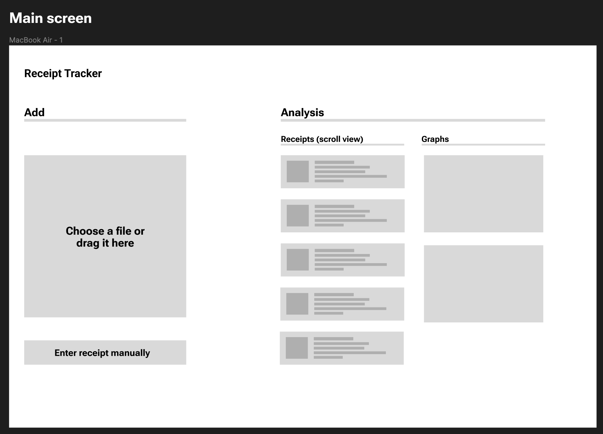
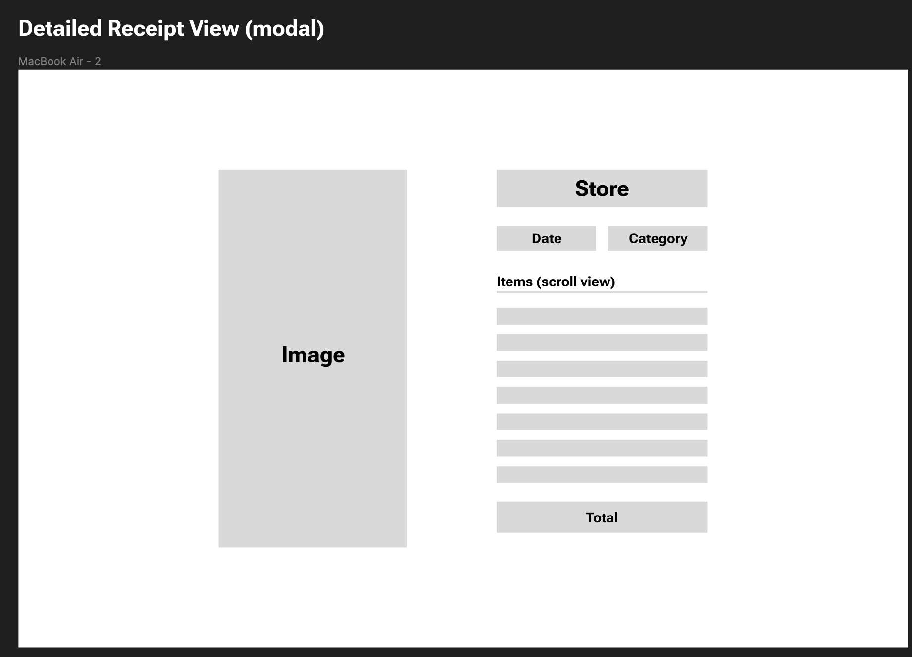
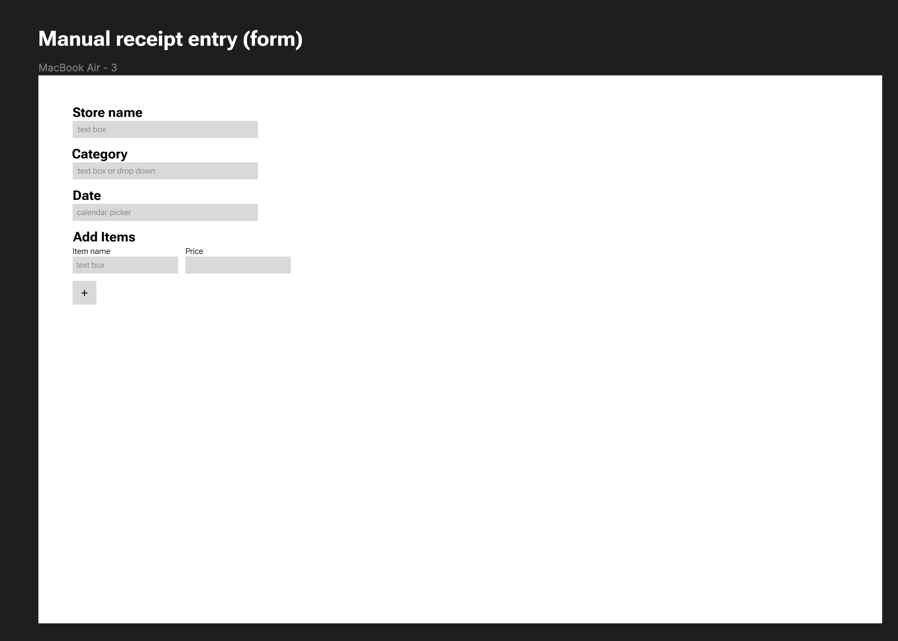

[](https://youtu.be/-qDquOm4krM)
</a>
</p>


<p align="center">


</p>

<p></p>
<p></p>

## Project Blurb


Our project is a simple and smart app that makes it easy to keep track of your receipts and manage your money. Since the popular app Mint closed down, there's a gap in the market for a good financial tool. Our app fills this gap.

Here's what it does:

1. Scan Receipts Easily: Just scan your receipts with the app. It uses OpenAI's technology to read and store them quickly.
2. Stay On Budget: The app shows you where your money goes, helping you stick to your budget.
3. Ask Questions: Got questions about your spending? Ask the app's finance assistant for help.

In short, our app makes it easy to track your spending and get better at managing your money.

## 🔍 Table of Contents

* [💻 Stack](#stack)

* [📝 Project Summary](#project-summary)

* [⚙️ Setting Up](#setting-up)

* [🚀 Run Locally](#run-locally)

* [🙌 Contributors](#contributors)

* [📄 License](#license)

## 💻 Stack

- Framework - [Next.js 13](https://nextjs.org/13)
- Language - [TypeScript](https://www.typescriptlang.org)
- API Endpoints - [tRPC](https://trpc.io/)
- Auth - [Clerk](https://clerk.com/)
- Database - [PlanetScale](https://planetscale.com)
- Deployment - [Vercel](https://vercel.com/docs/concepts/next.js/overview)
- Styling - [Tailwind CSS](https://tailwindcss.com)
- Components - [Tremor](https://www.tremor.so) & [Shadcn](https://ui.shadcn.com/)
- ORM - [Drizzle](https://orm.drizzle.team/)
- Linting - [ESLint](https://eslint.org)
- Formatting - [Prettier](https://prettier.io)

## ⚙️ Setting Up

#### Your Environment Variable

Create an developer account with PlanetScale, Clerk, UploadThing & OpenAI and then fill your keys in the .env.example file after renaming it to .env.local

## 🚀 Run Locally
1. Clone the 307-project repository:
```sh
git clone https://github.com/arnenoori/307-project
```
2. Install the dependencies with one of the package managers listed below:
```sh 
npm install
```
3. Start the development mode:
```sh 
npm run dev
```

## Contributing Guide

```
Style guidelines:

Arrow Function Parentheses- Always include parentheses around a sole arrow function parameter

Quotes- Use single quotes instead of double quotes

Tab Width- Specifys the number of spaces per indentation-level, we are doing 2

Trailing Commas- No trailing commas

Prettier Installation:

Install through VS Code extensions. Search for Prettier - Code formatter

Or

Can also be installed in VS Code: Launch VS Code Quick Open (Ctrl+P), paste the following command, and press enter.
ext install esbenp.prettier-vscode
```

## UI Prototype







[UI Prototype](https://www.figma.com/file/JOfZyj1V5je28YghGy0eox/Receipts?type=design&mode=design)

## UML

<p align="center">
<a href=https://github.com/arnenoori/307-project target="_blank">
</a>
</p>


## Testing

1. Cypress: We attempted to test our website using Cypress, but almost all of our functionality is accessable only after signin through clerk auth.

2. Pytest: We have pytests for the majority of our old backend code in backend-old/testing
    instructions: 
    pip install pytest
    pytest : pytest
    pip install coverage
    coverage run -m pytest
